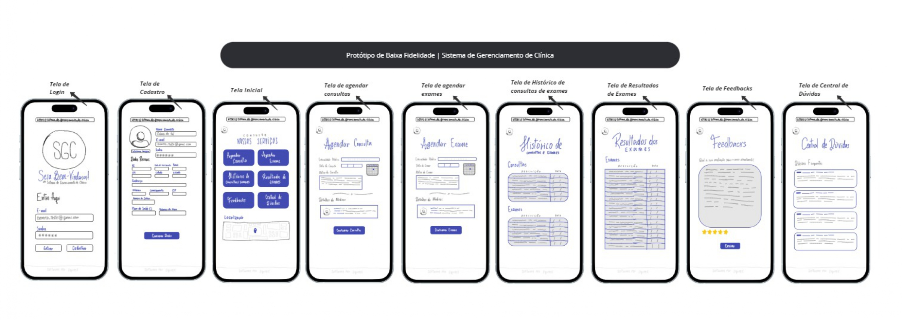
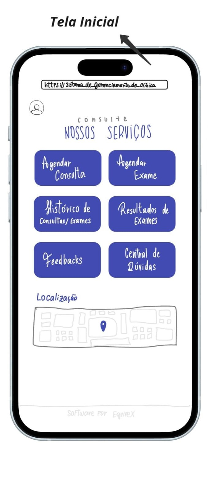
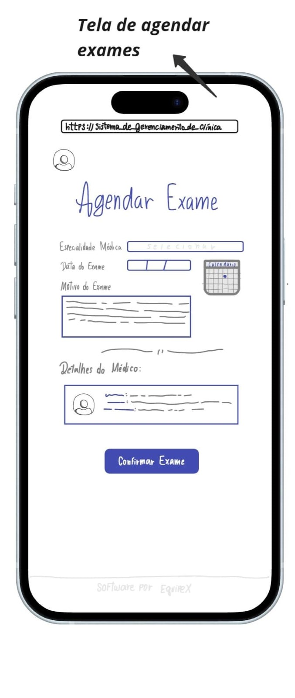
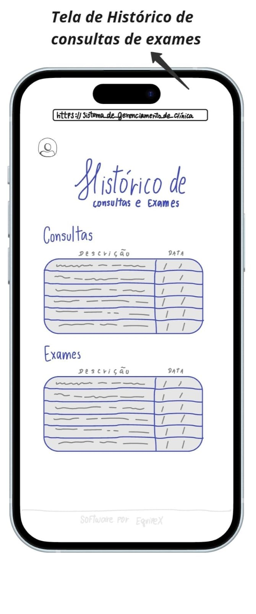

  <strong>
    <a href="./README.md">Português</a>
    &nbsp;|&nbsp;
    English
  </strong>

# Clinic Management System (CMS)

This project was developed as part of the Computer Science course at the Catholic University of Pernambuco for the Software Processes and Requirements discipline. The objective is to apply the knowledge acquired in the creation of an activity management system.

## Team:
- Dayvison Gabriel  
- Gabrielly Gouveia  
- Kailane Lisley  
- Noemi Soares  

## System Textual Description
The Clinic Management System (CMS) is a system developed to manage the activities of a private medical clinic, offering users a simplified interface. The main objective is to facilitate the service flow and make the clinic’s services more accessible to patients. The system offers the following functionalities:

1. Create registrations and update them when necessary;
2. Schedule medical consultations and exams for a specific specialty;
3. Establish priorities for scheduled consultations and exams;
4. Cancel scheduled consultations or exams;
5. View the history of consultations, exams, and treatments performed at the clinic;
6. View a summary of scheduled consultations or exams;
7. View invoices for scheduled consultations and exams;
8. Pay invoices for consultations and exams performed at the clinic;
9. Receive exam results;
10. Submit feedback about the service provided by the clinic;
11. Access customer support and a help center.

## Motivation
The main motivation for developing the CMS is to facilitate the service flow of a private clinic and make its services more accessible to patients. The system aims to save time and resources, allowing the clinic to redirect investments to more advanced and technological areas, ensuring high-quality care.

## Use Case Diagram
The use case diagram of the Clinic Management System (CMS) illustrates the main interactions between patients and the system. Patients can log in, register, access consultation scheduling, and manage personal information. They can also choose specific services such as scheduling consultations, booking exams, checking their medical history, and viewing exam results. Additionally, the system includes administrative functionalities to manage offered services, patient records, and available schedules for consultations and exams. The include and extend relationships between use cases indicate how additional functionalities are accessed and integrated into the main system operation flow.

    

## Low-Fidelity Prototype
The low-fidelity prototype of the Clinic Management System (CMS) presents the main application screens, highlighting essential functionalities. It includes login screens, registration, consultation and exam scheduling, consultation history, exam results, feedback, and a help center. Each screen is sketched in a simple way to validate the interaction flow and usability before detailed development. This prototype serves as a preliminary visualization to collect initial feedback and guide future improvements.

    

    
    
    
    
    
    
    
    
    

## User Stories

1. **As a patient**, I would like to schedule a consultation.  
   - **Acceptance Test**: Verify that the system allows the patient to schedule a consultation and confirm the appointment with a specific reserved time slot.

2. **As a patient**, I would like to access my exam results in a simplified and remote way.  
   - **Acceptance Test**: Verify that the system displays exam results clearly and accessibly, allowing the patient to understand the information without the need for in-person assistance.

3. **As a patient**, I would like to update my health information to ensure my records are always up to date.  
   - **Acceptance Test**: Verify that the system allows the patient to update registration information, including health insurance data, and correctly confirms the updates.

4. **As a patient**, I would like to receive notifications about my scheduled consultations.  
   - **Acceptance Test**: Verify that the system sends automatic notifications to patients about scheduled consultations with sufficient advance notice.

5. **As a patient**, I would like to have access to my complete medical history, including consultations, exams, and treatments.  
   - **Acceptance Test**: Verify that the system displays the patient’s complete medical history in an organized and easily understandable way.

6. **As a patient**, I would like the opportunity to provide feedback about the service received at the clinic.  
   - **Acceptance Test**: Verify that the system records patient feedback and forwards it to the responsible team.

7. **As a patient**, I would like to schedule consultations with specific specialists.  
   - **Acceptance Test**: Verify that the system allows the patient to select a desired specialty and schedule consultations with available specialists.

8. **As a patient**, I would like to view all information related to my consultation, such as date, time, medical specialty, and location.  
   - **Acceptance Test**: Verify that the system displays all consultation details clearly and completely.

9. **As a patient**, I would like the option to cancel a scheduled consultation.  
   - **Acceptance Test**: Verify that the system allows the patient to cancel a scheduled consultation and frees the time slot.

10. **As a patient**, I would like access to a support channel to clarify doubts or report issues related to my care.  
    - **Acceptance Test**: Verify that the system provides an accessible support channel, such as online chat or help center.

11. **As a patient**, I would like the option to schedule a consultation as a priority.  
    - **Acceptance Test**: Verify that the system allows priority consultation scheduling with reserved preferential time slots.

12. **As a patient**, I would like to view and pay my consultation and exam invoices online.  
    - **Acceptance Test**: Verify that the system allows patients to access pending invoices and make secure online payments.

## Subtasks

1. **Consultation Scheduling**:
- **1A**: Implement the consultation scheduling interface.
- **1B**: Implement verification of available dates and times.
- **1C**: Develop appointment confirmation functionality.
- **1D**: Receive appointment information.

4. **Notification Sending**:
- **4A**: Define notification channels.
- **4B**: Develop automatic notification sending functionality.
- **4C**: Configure notification lead time.
- **4D**: Validate notification delivery.

8. **Consultation Information**:
- **8A**: Develop interface to display scheduled consultation information.
- **8B**: Access consultation data from the scheduling system.
- **8C**: Display updated consultation information.
- **8D**: Allow access to consultation details.

9. **Consultation Cancellation**:
- **9A**: Implement consultation cancellation functionality.
- **9B**: Allow patient to select the consultation to cancel.
- **9C**: Validate patient permission to cancel.
- **9D**: Register cancellation and update schedule availability.

11. **Priority Consultation Scheduling**:
- **11A**: Include priority scheduling option.
- **11B**: Define criteria for priority consultations.
- **11C**: Allocate specific time slots for priority consultations.
- **11D**: Register priority consultation scheduling.

12. **Invoice Viewing and Payment**:
- **12A**: Implement invoice viewing area.
- **12B**: Display pending invoices.
- **12C**: Allow detailed invoice viewing.
- **12D**: Integrate a secure online payment platform.
- **12E**: Record completed payments.
- **12F**: Send payment receipt to the patient.
