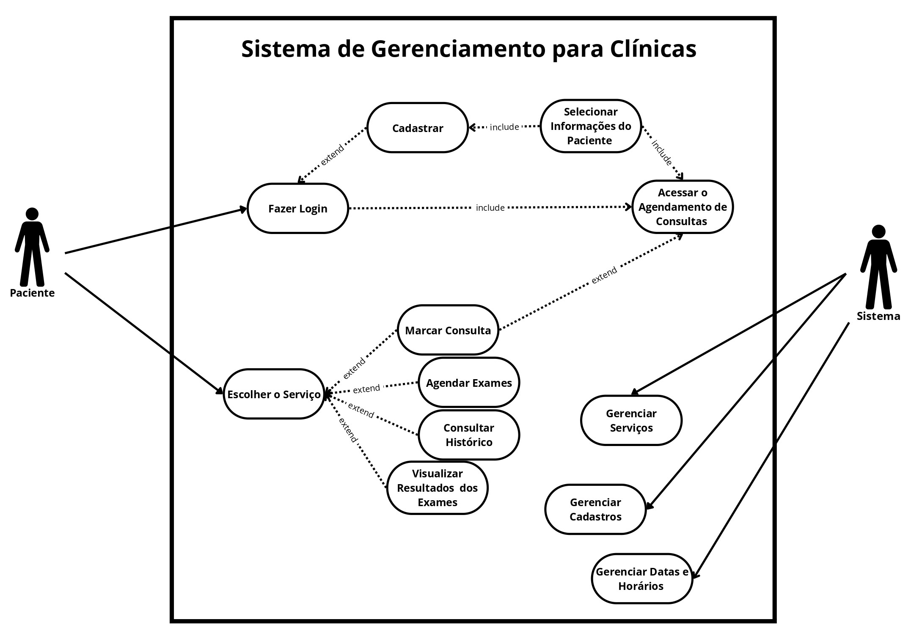
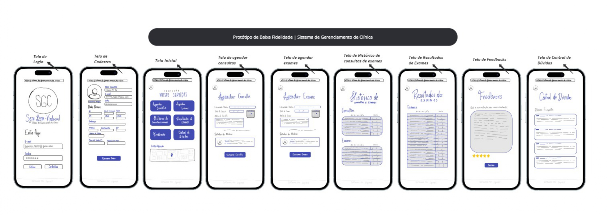

# Sistema de Gerenciamento para Clínicas (SGC)

Este projeto foi desenvolvido como parte do curso de Ciências da Computação da Universidade Católica de Pernambuco para a disciplina de Processos e Requisitos de Software. O objetivo é aplicar os conhecimentos adquiridos na criação de um sistema de gerenciamento de atividades.

## Equipe:
- Dayvison Gabriel
- Gabrielly Gouveia
- Kailane Lisley
- Noemi Soares

## Descrição Textual do Sistema
O Sistema de Gerenciamento para Clínicas (SGC) é um sistema desenvolvido para gerenciar as atividades de uma clínica médica particular que oferece aos usuários uma interface simplificada. O objetivo principal é facilitar o fluxo de atendimento e tornar os serviços da clínica mais acessíveis aos pacientes. O sistema oferece as seguintes funcionalidades:

1. Criar cadastros e atualizá-los quando necessário;
2. Agendar consultas e exames médicos de uma determinada especialidade;
3. Estabelecer prioridades para consultas e exames agendados;
4. Cancelar agendamentos de consultas ou exames;
5. Visualizar o histórico de consultas, exames e tratamentos realizados na clínica;
6. Visualizar o resumo dos agendamentos de consultas ou exames;
7. Visualizar faturas de consultas e exames agendados;
8. Pagar faturas de consultas e exames realizados na clínica;
9. Receber os resultados de exames;
10. Enviar feedbacks sobre o atendimento para a clínica;
11. Acessar suporte de atendimento e central de dúvidas.

## Motivação
A principal motivação para o desenvolvimento do SGC é facilitar o fluxo de atendimento de uma clínica particular e tornar os serviços mais acessíveis aos pacientes. O sistema visa economizar tempo e recursos, permitindo que a clínica redirecione investimentos para áreas mais avançadas e tecnológicas, garantindo um atendimento de alta qualidade.

## Diagrama de Casos de Uso
O diagrama de casos de uso do Sistema de Gerenciamento para Clínicas (SGC) ilustra as interações principais entre os pacientes e o sistema. Os pacientes podem fazer login, cadastrar-se, acessar o agendamento de consultas e selecionar informações pessoais. Eles também podem escolher serviços específicos como marcar consultas, agendar exames, consultar seu histórico médico e visualizar resultados de exames. Além disso, o sistema possui funcionalidades administrativas para gerenciar serviços oferecidos, cadastros de pacientes e horários disponíveis para consultas e exames. As relações de inclusão e extensão entre os casos de uso indicam como funcionalidades adicionais são acessadas e integradas ao fluxo principal de operações do sistema.

    

## Protótipo de Baixa Fidelidade
O protótipo de baixa fidelidade do Sistema de Gerenciamento para Clínicas (SGC) apresenta as principais telas da aplicação, destacando as funcionalidades essenciais. Inclui telas de login, cadastro, agendamento de consultas e exames, histórico de consultas, resultados de exames, feedbacks e central de dúvidas. Cada tela é esboçada de forma simples para validar o fluxo de interação e usabilidade antes do desenvolvimento detalhado. Este protótipo serve como uma visualização preliminar para coletar feedbacks iniciais e orientar melhorias futuras.

    

## Histórias de Usuário

1. **Como paciente**, eu gostaria de agendar uma consulta.
   - **Teste de Aceitação**: Verificar se o sistema permite ao paciente marcar uma consulta e confirmar o agendamento com reserva de horário específico para atendimento.

2.  **Como paciente**, eu gostaria de poder acessar os resultados dos meus exames de forma simplificada e remota.
    - **Teste de Aceitação**: Verificar se o sistema exibe os resultados dos exames de forma clara e acessível, permitindo que o paciente compreenda as informações sem a necessidade de assistência presencial.

3. **Como paciente**, eu gostaria de poder atualizar minhas informações de saúde, para garantir que meu cadastro esteja sempre atualizado.
   - **Teste de Aceitação**: Verificar se o sistema permite ao paciente atualizar as informações do cadastro, incluindo informações sobre o plano de saúde, e confirmar a atualização correta das informações.

4.  **Como paciente**, eu gostaria de receber notificações sobre minhas consultas agendadas.
    - **Teste de Aceitação**: Verificar se o sistema envia notificações automáticas ao paciente sobre consultas agendadas com antecedência suficiente para o paciente se preparar.

5. **Como paciente**, eu gostaria de ter acesso ao meu histórico médico completo, consultas, exames e tratamentos realizados.
   - **Teste de Aceitação**: Verificar se o sistema exibe o histórico médico completo do paciente de forma organizada e de fácil entendimento, incluindo consultas anteriores, exames realizados e tratamentos prescritos.

6. **Como paciente**, eu gostaria de ter a oportunidade de fornecer feedback sobre o atendimento recebido na clínica.
   - **Teste de Aceitação**: Verificar se o sistema registra o feedback do paciente e encaminha para a equipe responsável, garantindo que as sugestões sejam recebidas.

7. **Como paciente**, eu gostaria de poder agendar consultas com especialistas específicos, para receber o atendimento mais adequado.
   - **Teste de Aceitação**: Verificar se o sistema permite ao paciente selecionar a especialidade desejada e agendar consultas com os especialistas disponíveis, confirmando o agendamento com sucesso.

8. **Como paciente**, eu gostaria de poder visualizar todas as informações relacionadas à minha consulta, como data, hora, especialidade médica e local do atendimento.
   - **Teste de Aceitação**: Verificar se o sistema exibe todas as informações da consulta de forma clara e completa, possibilitando ao paciente acessar detalhes relevantes sobre o agendamento.

9. **Como paciente**, eu gostaria de ter a opção de cancelar uma consulta agendada.
   - **Teste de Aceitação**: Verificar se o sistema permite ao paciente cancelar uma consulta agendada, garantindo que o horário seja liberado e disponibilizado para outros pacientes, e confirmando o cancelamento com sucesso.

10. **Como paciente**, eu gostaria de ter acesso a um canal de suporte para esclarecer dúvidas, fazer solicitações ou relatar problemas relacionados ao meu atendimento na clínica.
    - **Teste de Aceitação**: Verificar se o sistema oferece um canal de suporte acessível ao paciente, como chat online ou central telefônica, para atender às dúvidas, solicitações e problemas relatados pelos usuários de forma eficiente e satisfatória.

11. **Como paciente**, eu gostaria de ter a opção de agendar uma consulta como prioritária.
    - **Teste de Aceitação**: Verificar se o sistema permite ao paciente marcar uma consulta como prioritária e confirmar o agendamento com reserva de horário específico para atendimento preferencial.

12. **Como paciente**, eu gostaria de poder visualizar e pagar minhas faturas de consultas e exames online.
    - **Teste de Aceitação**: Verificar se o sistema permite ao paciente acessar as faturas pendentes e efetuar pagamentos de forma segura e virtualmente.

## Subtarefas

1. **Agendamento de Consultas**:
- **1A**: Implementar a interface de agendamento de consultas.
- **1B**: Implementar a verificação de datas/horários disponíveis para o agendamento.
- **1C**: Desenvolver a funcionalidade de confirmação de agendamento.
- **1D**: Receber as informações do agendamento.

4. **Envio de Notificações**:
- **4A**: Definir os canais de notificação.
- **4B**: Desenvolver a funcionalidade de envio de notificações automáticas.
- **4C**: Configurar a antecedência das notificações.
- **4D**: Validar o recebimento das notificações pelos pacientes.

8. **Informações da Consulta**:
- **8A**: Desenvolver interface para exibir as informações da consulta agendada.
- **8B**: Acessar os dados da consulta agendada no sistema de agendamento.
- **8C**: Exibir as informações da consulta de forma atualizada.
- **8D**: Permitir acesso às informações da consulta.

9. **Cancelamento de Consulta**:
- **9A**: Implementar a funcionalidade de cancelamento de consulta.
- **9B**: Permitir que o paciente selecione a consulta que deseja cancelar.
- **9C**: Validar a consulta selecionada para garantir que o paciente tenha permissão para cancelá-la.
- **9D**: Registrar o cancelamento da consulta no sistema e atualizar a disponibilidade do horário.

11. **Agendamento de Consulta Prioritária**:
- **11A**: Incluir a opção de agendar consulta como prioritária.
- **11B**: Definir critérios para determinar quais consultas devem ser consideradas prioritárias.
- **11C**: Alocar um horário específico para a consulta prioritária, garantindo atendimento preferencial ao paciente.
- **11D**: Registrar o agendamento de consultas prioritárias.

12. **Visualização e Pagamento de Faturas**:
- **12A**: Implementar a área de visualização de faturas.
- **12B**: Exibir as faturas pendentes de consultas e exames para o paciente.
- **12C**: Permitir que o paciente visualize o detalhamento de cada fatura, incluindo valores, datas e serviços prestados.
- **12D**: Integrar uma plataforma de pagamento online segura para que o paciente possa efetuar o pagamento das faturas.
- **12E**: Registrar os pagamentos realizados pelos pacientes.
- **12F**: Enviar um recibo ou comprovante de pagamento ao paciente após a efetivação do pagamento.

